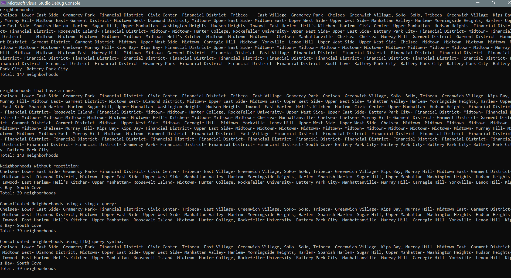

# Lab09-LINQInManhattan

this is a simple app made using C#, it reads data from data.json file, and filters neighborhoods using multiple LINQ queries and methods.
this app uses Newtonsoft.json for deserializing json data into a RootObject class.

## example output:

### to use this app:

- clone this repo
- open it in visual studio
- install Newtonsoft.json
- modify main method functions calling to render different output in console.

